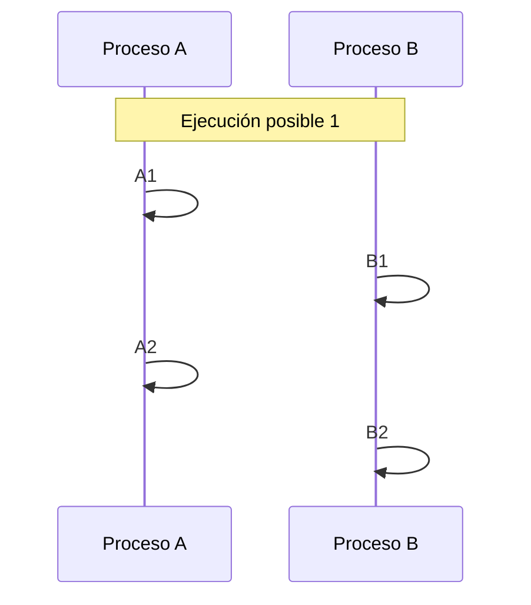
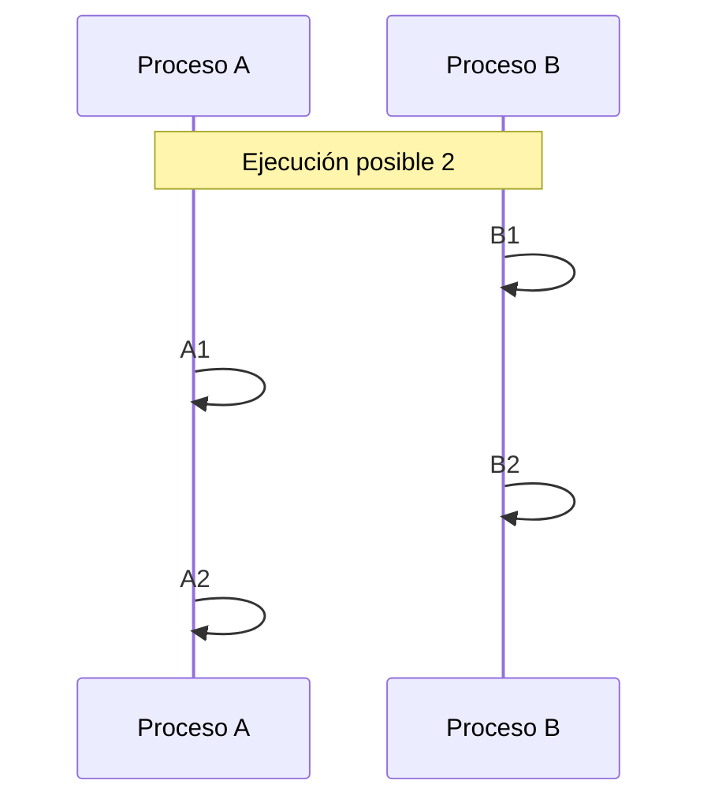
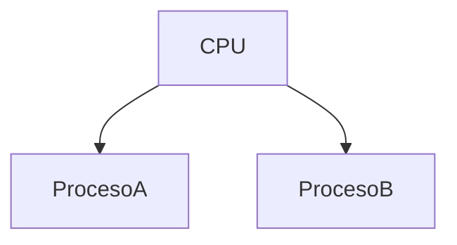
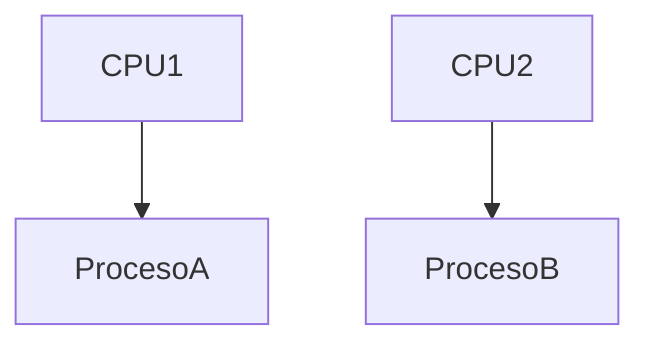
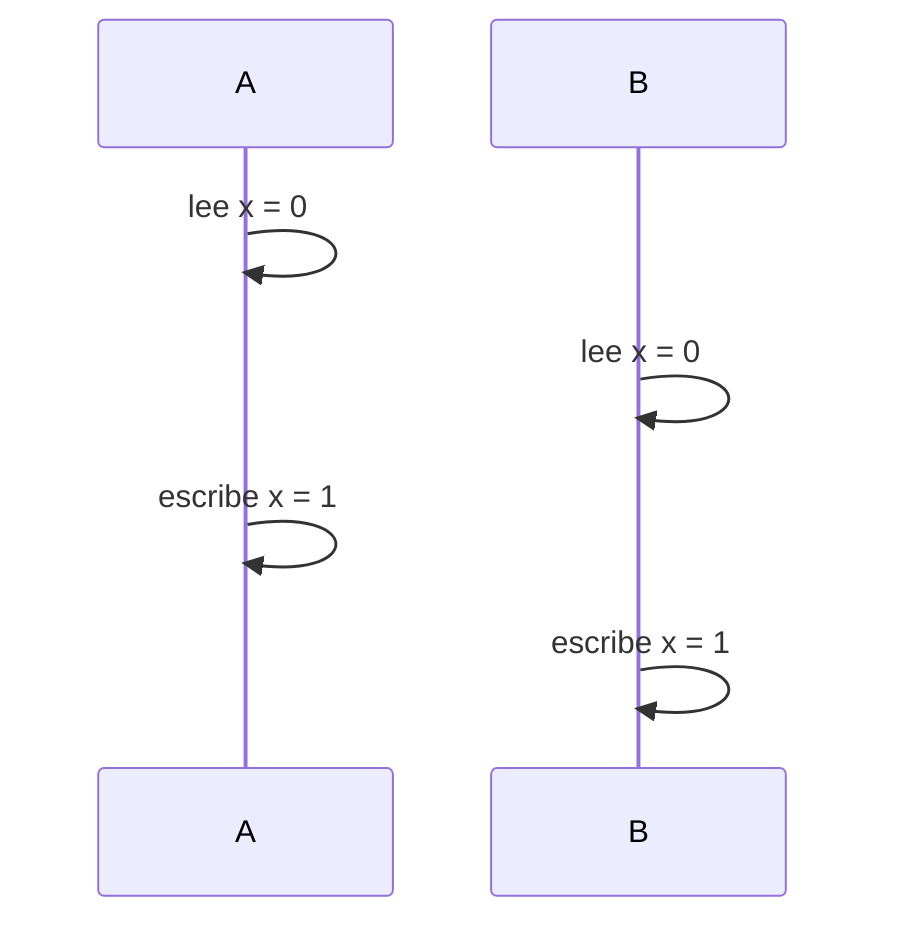
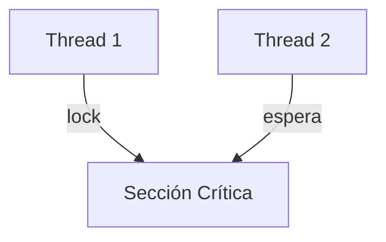
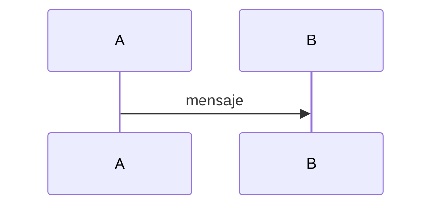

# Semana 1: Fundamentos Formales de la Concurrencia

## 1. ¿Qué es la Programación Concurrente?
La programación concurrente estudia sistemas donde múltiples unidades de ejecución avanzan de manera solapada en el tiempo.

Palabra clave: 
 - **Solapada:** significa que progresan "mezcladas" en el tiempo, aunque no necesariamente al mismo tiempo físico.

La idea central es:
No todo ocurre en orden perfectamente secuencial.
En un programa tradicional:
Instrucción 1 → Instrucción 2 → Instrucción 3

En un programa concurrente:

Proceso A hace algo,
Proceso B hace algo,
Luego A sigue,
Luego B sigue.

El orden puede variar.

## 2. Programa Secuencial
> **programa secuencial:** Un conjunto de instrucciones que se ejecutan una después de la otra en un único flujo de control.

> **Flujo de control:** Es el orden en el que se ejecutan las instrucciones.

Ejemplo:
```rust
fn main() {
    let mut x = 0;
    x += 1; // Instrucción 1
    x += 2; // Instrucción 2
    println!("Valor de x: {}", x); // Instrucción 3
}
```
Aquí no hay ambigüedad.
Siempre se ejecuta en el mismo orden.

Esto se llama ejecución determinística:
Siempre produce el mismo resultado.

## 3. Programa Concurrente

> **Programa concurrente**: Un conjunto finito de procesos secuenciales que pueden ejecutarse intercaladamente.

Cada proceso mantiene su orden interno,  
pero el orden global puede variar debido al interleaving.

<style>
.diagram-row {
    display: flex;
    gap: 2rem;
    justify-content: center;
    align-items: flex-start;
    flex-wrap: wrap;
}
.diagram-col {
    flex: 1 1 45%;
    max-width: 500px;
}
</style>

<div class="diagram-row">

<div class="diagram-col">



</div>

<div class="diagram-col">



</div>

</div>

Ese intercalado puede variar
  
## 4. Interleaving (Intercalado)

> **Interleaving:**
Intercalado arbitrario de instrucciones atómicas.

>**Instrucción atómica:**
Es una operación indivisible que se ejecuta completamente o no se ejecuta en absoluto. No puede ejecutarse "a medias".

>**Modelo formal:**
La ejecución global del sistema resulta de intercalar arbitrariamente las instrucciones atómicas de todos los procesos.

El orden puede cambiar.

Eso genera múltiples posibles ejecuciones.

## 5. Concurrencia vs Paralelismo

>**Concurrencia:**
Múltiples procesos progresan en el tiempo.

> **Paralelismo:**
Múltiples procesos se ejecutan físicamente al mismo tiempo en distintos procesadores.
  
En una máquina con un solo CPU puede haber concurrencia (intercalado), pero no paralelismo real.

Diagrama Conceptual:

Aquí el CPU alterna entre ambos.

En paralelismo real:


## 6. Multitasking
> **Multitasking:**
Capacidad del sistema operativo de ejecutar múltiples procesos en un período de tiempo.

El scheduler (planificador) del sistema operativo es el que decide:

- Qué proceso se ejecuta
- Cuánto tiempo
- Cuándo cambiar de proceso

El scheduler hace cambio de contexto.

>**Cambio de contexto (Context Switch):** Guardar el estado actual de un proceso para cargar el estado de otro proceso.
  

## 7. Multithreading
>**Thread:** Unidad liviana de ejecución dentro de un proceso.

Características:
 - Comparten memoria.
 - Son más rápidos que procesos
 - Requieren sincronización para evitar conflictos.

Ejemplo simple en Rust:
```rust
use std::thread;
fn main() {
    let handle = thread::spawn(|| {
        println!("Hola desde el hilo!");
    });

    handle.join().unwrap();
}
```

>**spawn:** Crea un nuevo hilo.

>**join:** Espera a que el hilo termine.

## 8. Problema Fundamental: Condición de Carrera (Race Condition)
> **Condición de carrera:** Ocurre cuando el resultado depende del orden de ejecución.

Ejemplo:
```rust
use std::thread;

static mut X: i32 = 0;

fn main() {
    let mut handles = vec![];

    for _ in 0..2 {
        handles.push(thread::spawn(|| {
            for _ in 0..100000 {
                unsafe {
                    X += 1;
                }
            }
        }));
    }

    for h in handles {
        h.join().unwrap();
    }

    unsafe {
        println!("Valor final de X: {}", X);
    }
}
```

Ejecutar el programa varias veces y observar que el resultado puede variar.
Resultado esperado: 200000
Pero puede ser menor debido a la condición de carrera.

Diagrama:

Resultado incorrecto.

9. Sincronización
> **Sincronización:** Mecanismos que coordinan el acceso a recursos compartidos.

>**Recurso:** Algo que múltiples procesos quieren usar (ej. variable, archivo).

Ejemplo conceptual con lock:


>**Sección crítica:** Parte del código que accede a recursos compartidos y debe ser ejecutada por un solo proceso a la vez.

## 10. Comunicación

> **Comunicación:** Intercambio de información entre procesos.

Puede hacerse mediante:
1. Memoria compartida
2. Paso de mensajes
   
>**Paso de mensajes:** Enviar datos a través de canales o colas.
Ejemplo de paso de mensajes en Rust:

No comparten memoria directamente.

## 11. Modelo Formal Resumido

Un sistema concurrente está compuesto por:
- Un conjunto finito de procesos.
- Cada proceso tiene instrucciones atómicas.
- La ejecución global es un intercalado arbitrario de esas instrucciones.
  
El análisis consiste en:
Examinar todos los posibles interleavings.

Eso permite demostrar correctitud.

>**Correctitud:** Que el programa funcione bien bajo cualquier orden posible.


## 12. ¿Por qué es difícil la concurrencia?

Porque:
- Hay múltiples órdenes posibles.
- El resultado puede cambiar.
- Aparecen errores no determinísticos.

>**No determinístico:** El resultado puede variar entre ejecuciones.